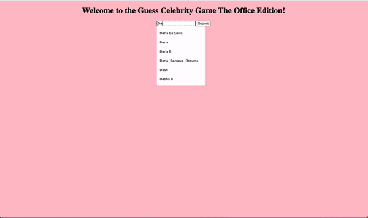

# Guess The Celebrity Game: Office Edition

## Content:
 
You will create:
- A single ***HTML document*** 
- A single ***CSS document*** 
- A single ***JavaScript document***
- Images of celebrities 

## Setup:
Project created using JavaScript, HTML, CSS, Node.js.
 
## Game Specifications:

- The user should enter their name (it will be stored along with their score). Program validates this as an alphanumeric string. 
- Webapp displays a picture of a celebrity one at a time and asks the user the guess/pick the celebrity's name. 
- Webapp keeps track of the user’s score.  
- Webapp displays three scores: the current score, the current user’s best score, and the overall best score on the computer/browser. 
- Webapp stores the user names  and the scores (current, best personal, all time best) in the browser’s localstorage.

